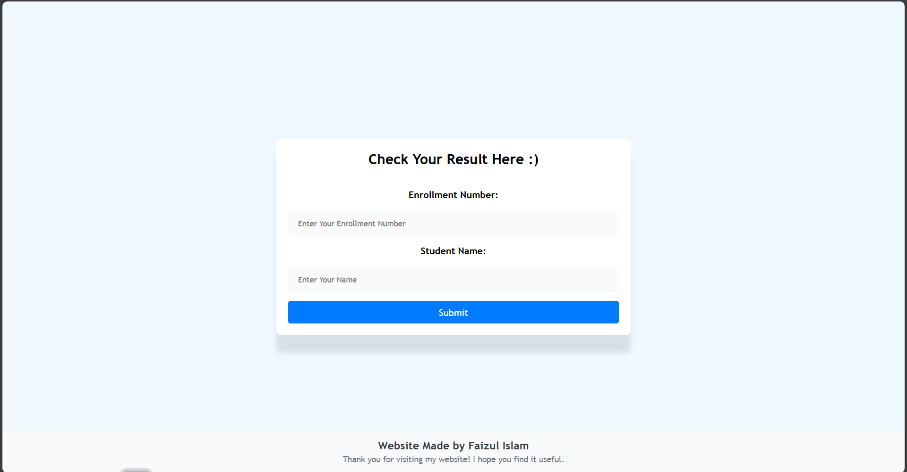
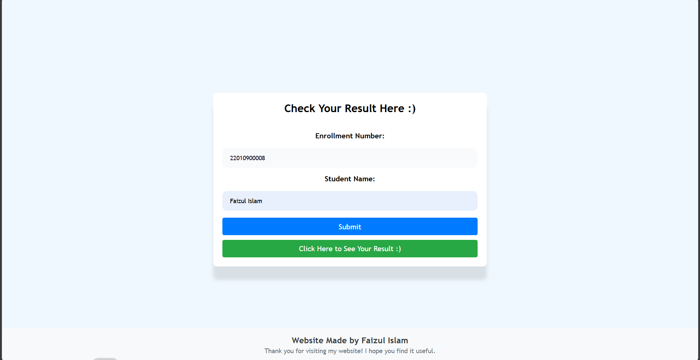
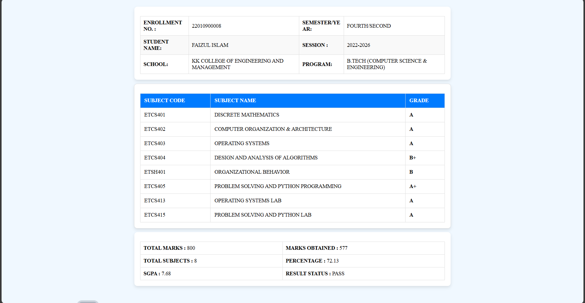

# ResultRover 📚  
_A lightweight academic result portal built with HTML, CSS, and JavaScript_

## Live - https://kkuniversityexamresults.netlify.app/

## ✨ Key Features  
- Instant result retrieval with enrollment number + name verification  
- Real-time input validation (no page reload needed)  
- Clean, responsive interface that works on all devices  
- 100% client-side logic (no backend dependencies)  

## 🛠️ How It Works  
1. **Enter Details**:  
     
   Students enter their enrollment number and full name.

2. **Submit & Verify**:  
     
   System validates credentials locally and shows success/error messages.

3. **View Results**:  
     
   Authenticated users see their complete academic results.

## 🔧 Technical Implementation  
- **Core**: Vanilla JavaScript (ES6+)  
- **UI**: Semantic HTML + CSS Flexbox/Grid  
- **Validation**: Regular expressions for input sanitization  
- **Performance**: Optimized DOM manipulation  

## 🌱 Why This Matters  
While simple in concept, this project demonstrates:  
✅ **Strong fundamentals** in core web technologies  
✅ **Problem-solving skills** through client-side validation  
✅ **User-focused design** with intuitive interactions  

## 📦 Setup  
1. Clone the repo:  
   ```bash
   git clone https://github.com/your-username/ResultRover.git
